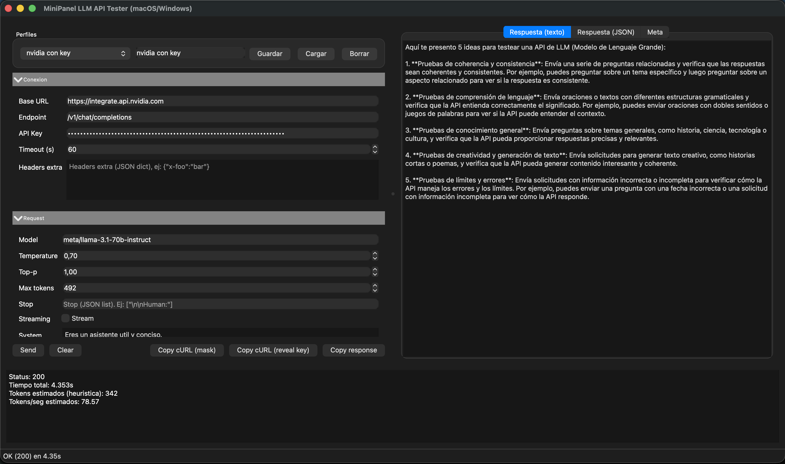

# MiniPanel LLM API Tester

Desktop GUI built with PySide6 to test OpenAI-style endpoints (chat/completions). Designed for fast iteration with streaming support, profiles, and basic performance metrics.

## Screenshot


## Features
- Connection setup: base URL, endpoint, API key, extra headers.
- Request editor: model, system/user prompts, params, streaming.
- Response tabs: text, JSON, metadata.
- Metrics: status, total time, TTFB, estimated tokens/sec.
- Profiles saved locally.
- Accordion sections and fixed action buttons.

## Tech Stack
- Python 3.9+
- PySide6
- Requests

## Install
```bash
pip install PySide6 requests
```

## Run
```bash
python main.py
```

Legacy entrypoint:
```bash
python llm_panel.py
```

## Dev Mode (auto-restart)
```bash
python dev.py
```

## Profiles & Security
- Profiles are stored in `~/.llm_panel_profiles.json`.
- API keys are masked when saved (not stored in plain text).

## Project Info
- Version: 0.1.0
- Creator: Alejandro Rodríguez
- URL: loopandgo.es

## Structure
- `main.py`: entrypoint
- `llm_panel.py`: legacy wrapper
- `dev.py`: auto-restart runner
- `app/config.py`: constants and config dataclass
- `app/utils.py`: helpers
- `app/storage.py`: profiles persistence
- `app/client.py`: HTTP client and request builders
- `app/worker.py`: Qt worker
- `app/ui.py`: UI and app startup
